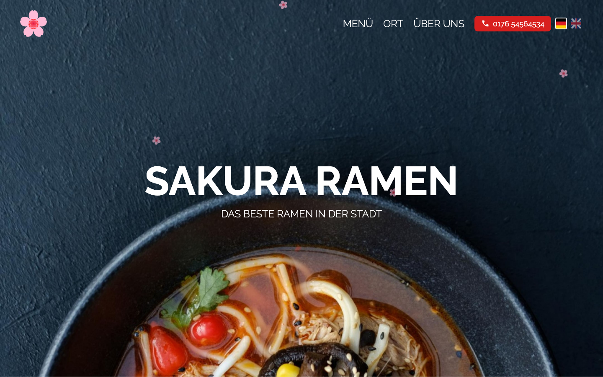
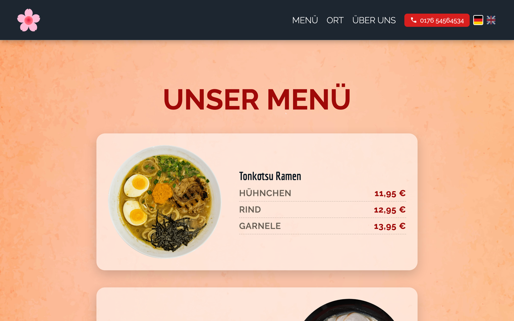
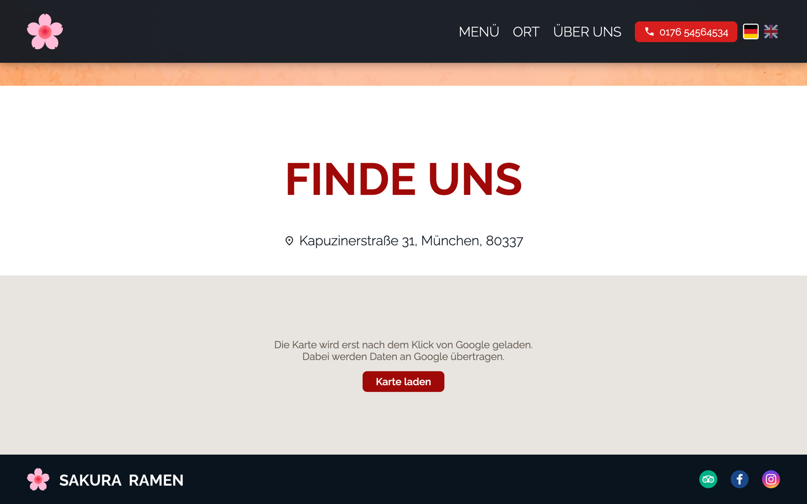

# Sakura Ramen


The website of a ramen restaurant, with menu, location and a full German/English language switch.

**Live: [sakura.weskakay.de](https://sakura.weskakay.de)**

## 💡 What is this?

Sakura Ramen is a one page restaurant site built by hand with HTML, CSS and a small amount of vanilla JavaScript. No framework, no bundler, no dependencies. The page walks a visitor from the hero straight through the ordering steps, the menu with its three broths and price tiers, the location and finally the footer.

Two parts carry most of the work. The first is the language layer: every piece of text lives in a single dictionary in `js/i18n.js`, elements are marked with `data-i18n`, `data-i18n-aria` and `data-i18n-content`, and switching the language rewrites the page including the document title, the meta description and the aria labels. The choice is remembered in `localStorage`, so a returning visitor keeps their language.

The second is the map. Embedding Google Maps directly would send visitor data to Google on every page load, so the map starts as a placeholder with a short notice and only builds the iframe after an explicit click.

The restaurant, its address, phone number and prices are made up. They exist so the page feels like a real business, they do not describe one.

## 📸 Screenshots







## 🧠 Features

✅ German and English switch covering text, title, meta description and aria labels
✅ Language choice stored in `localStorage` and restored on the next visit
✅ Menu with three ramen and a price tier each for chicken, beef and shrimp
✅ Ordering steps explained as noodles, broth and toppings
✅ Sticky header that turns solid once the hero has scrolled past
✅ Burger navigation on small screens that closes itself after a jump
✅ Scroll reveal through `IntersectionObserver`, with a no-JS fallback
✅ Map loads only after a click, with a notice about the data transfer
✅ Skip link, aria labels on icon links and visible focus states
✅ Self hosted fonts, so no request goes to a font CDN
✅ Responsive from 320px upwards

## 🖥️ Tech Stack

| Layer | Technology |
|---|---|
| Markup | Semantic HTML5 |
| Styling | CSS3 with Custom Properties |
| Language | JavaScript (ES2020, no modules, no bundler) |
| Fonts | Economica and Raleway, self hosted as woff2 |
| Animation | IntersectionObserver plus CSS transitions |
| Translations | Static dictionary in `js/i18n.js` |
| Backend | none |

## 🚀 Setup

No build step and no dependencies. Clone it and serve the folder:

```bash
git clone https://github.com/weskakay/sakura_ramen.git
cd sakura_ramen
python3 -m http.server 8000   # then open http://localhost:8000
```

Opening `index.html` from the file system works too, a local server just keeps the relative paths predictable.

## 📁 Project Structure

```
sakura_ramen/
├── css/
│   ├── fonts.css           # @font-face for Economica and Raleway
│   └── style.css           # Tokens in :root, then layout and sections
├── fonts/                  # woff2 files, latin and latin-ext
├── img/
│   ├── 1_hero/
│   ├── 2_section_how_to_order/
│   ├── 3_section_our_menu/
│   ├── 4_section_find_us_at/
│   ├── 5_section_footer/
│   └── 6_language/         # Flag icons for the switch
├── js/
│   ├── i18n.js             # Dictionary, switch and localStorage
│   └── ui.js               # Sticky header, burger nav, reveal, map consent
└── index.html
```

## 🎨 Design

Dark hero over a photo, warm apricot menu section, deep red as the accent. Colors, fonts, spacings, radii and the fluid type scale are defined once as CSS Custom Properties in `:root` and used as `var(--token)` everywhere else, so the section styles carry no loose hex values. Headlines run in Economica, body text in Raleway.

Type sizes scale with `clamp()` instead of stacking breakpoints, which keeps the layout readable between the fixed sizes rather than only at them.

## 📄 License

Private project, published for reference.
